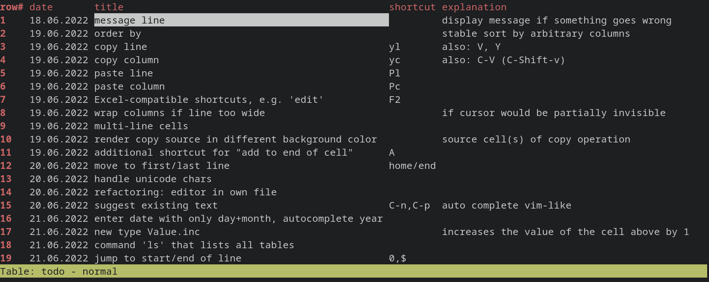

zspread - spreadsheet program in the terminal
=============================================



To use:

```
git clone https://github.com/zrayx/zspread.git --recursive
cd zspread
mkdir -p db
zig build run
```

All data is stored in csv files in the db/ subdirectory. The csv files are legible and suited for version control, e.g. with git. Date and time in world format (dd.mm.yyyy, 24-hour clock) are recognized and formatted, other formats are stored as text.

Changes are saved on every edit.

keyboard commands
=================
Keyboard commands are mostly the same as in vim, with a few adaptions.

cursor movement
---------------
many vi-like cursor movement keys work, like jklmgG, C-d/u/f/b etc.

insert, copy and delete
-----------------------
```
C-C  - copy a cell
C-V  - paste a cell
x    - delete a cell's contents
I    - insert column
O    - insert row above
o    - insert row below
dc   - delete column
dd   - delete row
```
editing a cell
--------------
```
i    - edit cell at start of cell
a    - edit cell at end of cell
C    - edit cell, delete old content
ESC  - stop editing
```
other commands
--------------
```
q       - quit the program
:e file - edit the file db/file.csv
```